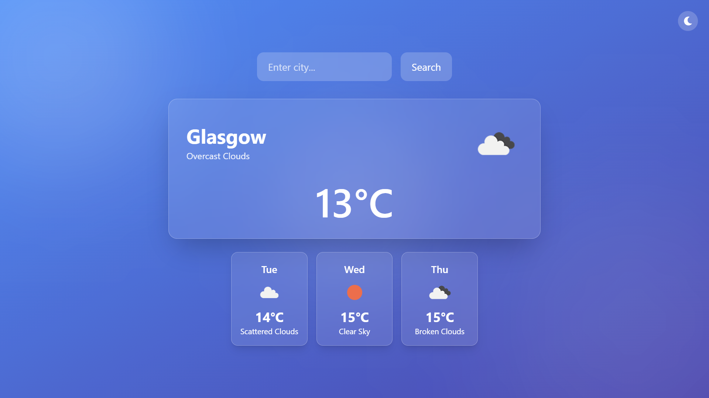
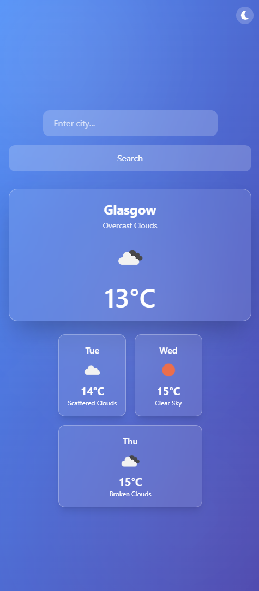
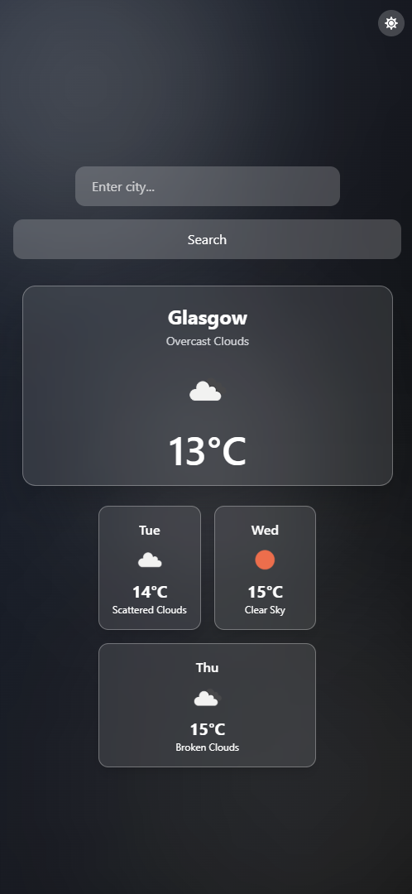

# 🌦️ Weather App — Liquid Glass Edition

A modern weather app with geolocation, 3-day forecast, dark/light theme toggle, and a minimalist glassmorphism UI. Built with **React + TypeScript + Tailwind CSS + OpenWeatherMap API**.

## 🚀 Live Demo

➡️ [https://weather.alexchuvara.dev](https://weather.alexchuvara.dev)  
*(replace with your actual Vercel or Netlify deployment link)*

---

## 📸 Screenshots

### 🌤️ Light Theme

| Desktop | Mobile |
|--------|--------|
|  |  |

---

### 🌙 Dark Theme

| Desktop | Mobile |
|--------|--------|
|  |  |
---

## 🧰 Tech Stack

- ⚛ **React + Vite**
- 🧠 **TypeScript**
- 🎨 **Tailwind CSS**
- 💨 **Framer Motion**
- ☀️ **Dark/Light theme with system preference and persistence**
- 🌍 **OpenWeatherMap API**
- 📦 **Vercel (deployment)**

---

## ✅ Features

- 🔍 Search weather by city
- 📍 Auto-detect user location via browser
- 🌦️ 3-day weather forecast
- 🌓 Dark/light theme toggle
- 🈯 Automatic weather description translation based on browser language (`en`, `uk`, `pl`, etc.)
- 📱 Fully responsive design (mobile-friendly)
- 🔮 Glassmorphic UI with blur effects
- 🌀 Loading spinner during API calls
- 🔐 Secure environment variables with `.env`

---

## ⚙️ Getting Started

```bash
# Clone the repo
git clone https://github.com/alexchuvara/weather-app.git
cd weather-app

# Install dependencies
npm install

# Create .env file
touch .env
